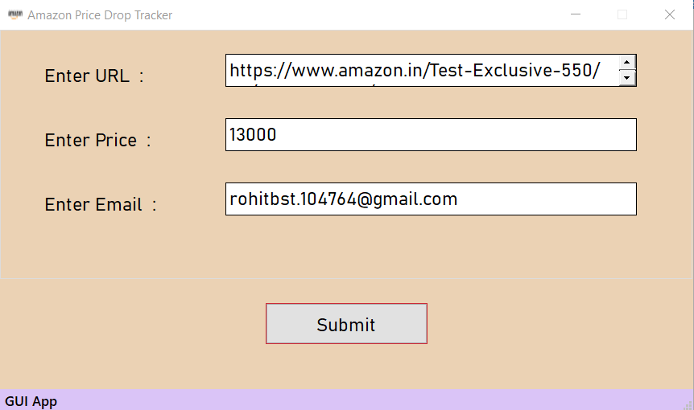
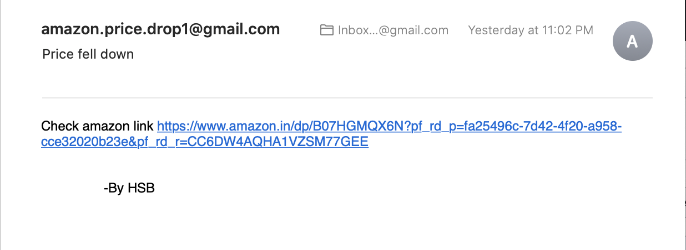

<p align="center">
    <h1 align="center">Amazon-Price-Drop-Alert</h1>
    
This script will send you an email when the price for specific items you followed on Amazon drops beneath a certain price you set.

</p> 

<p align="center">
    

[](https://github.com/harshsbais/Amazon-Price-Drop-Alert/issues)
[](https://github.com/harshsbais/Amazon-Price-Drop-Alert/blob/main/LICENSE)
[](https://github.com//harshsbais/Amazon-Price-Drop-Alert/stargazers)
[](https://github.com/harshsbais/Amazon-Price-Drop-Alert/issues)
[](https://img.shields.io/github/contributors/thinktocode/COVID-19-Tracker)
[](https://github.com/harshsbais/Amazon-Price-Drop-Alert)
[](https://github.com/harshsbais/Amazon-Price-Drop-Alert/pulls)
[](https://github.com//harshsbais/Amazon-Price-Drop-Alert/network/members)

</p>


**You can parse the price without Amazon API !**


## Installation
`pip install -r requirements.txt`


After installed required package, you can use it by
`python amazon.py`

## Required Accounts
```text
1. Google Mail
```


#### url
Get url from your amazon of your location. For example : URL of Amazon IN is `https://www.amazon.in/dp/...`
 

#### price
You need to put the price at which you would like to buy

#### email-address
Enter email address of which you have access as mail will be sent when price drops below your expected price


### How to run python script? 
#### Step 1.
After installing all the dependencies run amazon.py
#### Step 2.
Enter all information
#### Step 3.
Push the button and let the magic happen.

## Limitation
#### Checking interval time limitation
This code use some skill preventing banned by Amazon. However, the best interval time between each time of price checking is around 15 minutes.

### Why my script can't get price from Amazon?
There may be two problem of it.

1.Your ip was banned by Amazon

	Change your IP or wait for unban.


2.The item selector changed

### App-Format


### Email-Format



## Dependencies
```text
Python 3
bs4
PyQtWebEngine
smtplib
lxml
webdriver-manager
selenium
```

## Future feature
```text
** Script running in background for long and checking after every 1 hour **

** Complete standalone GUI app for MacOS and later for Windows **

** Mail will include a graph of price using matplotlib **
```
